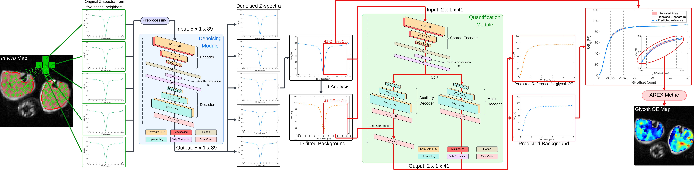

# Deep learning-enhanced MRI of muscle glycogen via magnetic coupling with water
###
Authors: Leqi Yin, Zhongliang Zu

We developed a deep learning framework, GlycoNOE Lorentzian-difference Autoencoder for Reference Extraction and Spectral-spatial Denoising (GLARES). This framework employs autoencoder-based modules to first denoise the Z-spectrum by leveraging both its intrinsic features and the coherence across spatially adjacent Z-spectra, and subsequently predicts a reference for quantifying the glycoNOE effect using both the Z-spectrum and its Lorentzian-difference-fitted reference as inputs.

## Detailed instructions for using code and data
### Training Data simulation
To generate training data, open **read_9pool_TMP_training.m**.
Save the variables whose names begin with the prefix DL for model training. 
Adjust the parameters and uncomment any code sections as needed.
### Model Training
To train the denoising and quantification modules, run **Training_DN.m** and **Training_QT.m**.  
The neural network architectures are defined in **GLARES_NN_DN.m** and **GLARES_NN_QT.m**.
The trained networks are stored in .mat files. Each file name begins with the prefix fitnet.
### Conventional Methods
The code for conventional methods is provided in files named after each method.  
Run these scripts directly to evaluate their performance.
### Data
In-vivo datasets are provided in **invivo_4p7T_3rats_0p25P_ALS_Je14.mat** (ALS rats) 
and  **invivo_4p7T_6rats_0p25P_Je16.mat** (control rats).  

A synthetic dataset, **TMP_4p7T_0p25P_Je18-M.mat**, 
is also included and can be used to evaluate the performance of different methods.

